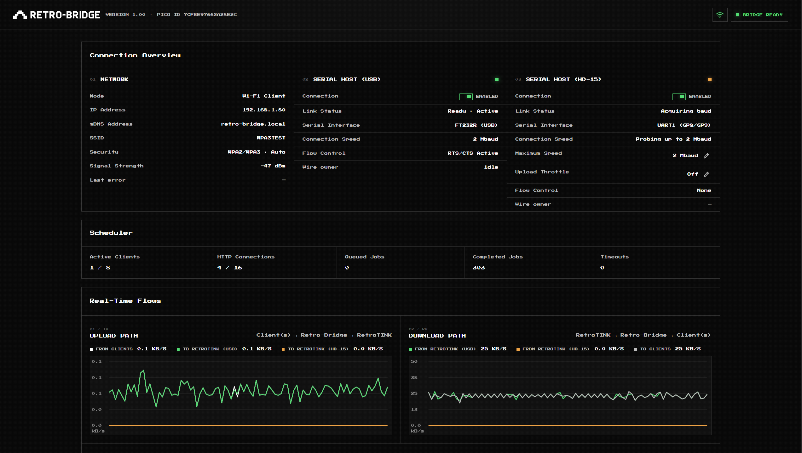

 

  <picture>
    <source media="(prefers-color-scheme: dark)" srcset="assets/retro-bridge-logo-light.svg">
    
  </picture>

Connect to your RetroTINK wirelessly

  

# Overview
Retro-Bridge connects your devices to your RetroTINK wirelessly. It serves as a Wi-Fi bridge for serial communication with RetroTINK devices, without the need for physical cables.

Connect to apps like [RetroTINK Remote](https://rt4k-remote.pipe.hr/) and [RetroTINK Profiler](https://rt4k-profiler.pipe.hr/) from any device. Send remote commands, update the firmware, manage files on the SD card, change settings in real-time, and more!

Developer documentation for the Retro-Bridge protocol will be released soon. Build your own integrations, automations, and fun projects with your RetroTINK (with no wires in sight!).

Retro-Bridge is based on a Raspberry Pi Pico 2 W, supports 2.4GHz Wi-Fi, and connects to your RetroTINK via USB or HD-15.

 

# Get Started

## Setup

### Recommended: USB Connection (4K Pro/CE)
You will need the following:
- Raspberry Pi Pico 2 W (must be Pico 2 W. It won't work on other models)
- Micro USB cable
- USB-C OTG cable

### Installation Instructions:
1. Download the latest version of Retro-Bridge from the [Releases page](https://github.com/solidpipe/retro-bridge/releases/latest). 
2. Hold the BOOTSEL button on the Pico as you're plugging the Micro USB to your computer. It should open as a drive in your Explorer.
3. Copy the `.uf2` file to the root of that drive. After the copy, the drive will disappear and the drive will disappear. You can unplug the Pico from the computer now.
4. Plug the Pico to the USB-C OTG cable connected to the Tink. Connect the USB-C power supply to the USB-C OTG cable. With everything powered on, the Pico will blink the LED.
5. Connect to the Wi-Fi network called "Retro-Bridge-XXXX". A captive portal page should open after about ~10 seconds.
6. Select your Wi-Fi network and enter your password. Hit Connect. If successful, the Pico will connect to your Wi-Fi and the captive portal should close on its own.
7. On your computer or phone, visit http://retro-bridge.local/. If you see the Retro-Bridge dashboard, the setup was successful!

## Updating Retro-Bridge
Updating the Retro-Bridge is easy. Simply follow the installation instructions steps 1-4. Retro-Bridge will remember your Wi-Fi credentials between firmware updates.

## Hardware Compatibility

| Model | USB | HD-15 | Note |
| :--- | :---: | :---: | --- |
| RetroTINK 4K Pro | ✅  | ✅ |
| RetroTINK 4K CE | ✅ | ✅ |
| RetroTINK 6X CE | ❌ | ✅ | 6X CE doesn't support serial USB. Compatible Retro-Bridge HD-15 boards will be available in the near future

*RetroTINK 5X, and 2X are not supported.
